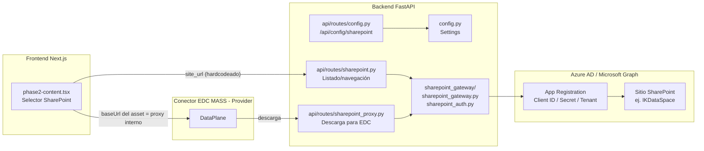

# Configuración de SharePoint — Cómo apuntar la aplicación a otro repositorio

**Fecha:** 23 de septiembre de 2026
**Aplicación:** `src/poc_next` (rutas `/data-publication` y `/partner-data`)
**Objetivo:** Documentar qué ficheros y variables hay que tocar para que la aplicación deje de trabajar contra el sitio SharePoint actual (`IKDataSpace`, tenant Ikerlan) y pase a trabajar contra otro repositorio/sitio SharePoint, tanto en local como en el despliegue de OVH.

> Este documento es solo informativo. No se ha modificado ningún fichero de código.

---

## 1. Arquitectura y componentes implicados



Hay **dos partes claramente diferenciadas** que acceden a SharePoint, y ambas deben configurarse coherentemente para apuntar al mismo sitio/repositorio:

1. **Navegación/selección de ficheros** (para crear un asset): el frontend llama a `GET /api/sharepoint/files/by-site-url?site_url=...`, que usa el **componente `sharepoint_gateway`** (`sharepoint_gateway.py` + `sharepoint_auth.py`) para resolver el sitio y listar su contenido vía Microsoft Graph.
2. **Descarga real del fichero por parte del EDC DataPlane** cuando se materializa una transferencia: el asset publicado contiene un `baseUrl` que apunta al **proxy SharePoint** (`api/routes/sharepoint_proxy.py`), que también usa `sharepoint_gateway` para autenticarse y descargar el fichero/carpeta real de SharePoint.

El componente `sharepoint_gateway` (carpeta `src/poc_next/backend/sharepoint_gateway/`) es, como bien dices, el que realmente habla con SharePoint. No conoce el sitio de forma fija: en el flujo de navegación recibe la URL del sitio como parámetro; en el flujo de descarga recibe `drive_id` + `item_id` ya calculados (embebidos en la URL del proxy cuando se creó el asset). Lo que sí necesita siempre son las **credenciales de Azure AD** (`SHAREPOINT_PROXY_CLIENT_ID/SECRET/TENANT_ID`), que son las que determinan a qué **tenant** de Microsoft 365 se conecta.

---

## 2. Los dos escenarios de ejecución

| | Local (`localhost`) | OVH / Kubernetes |
|---|---|---|
| Frontend | `pnpm dev` en `src/poc_next/frontend`, puerto 3020 | Imagen Docker `xmendialdua/poc-next-frontend`, desplegada en el namespace `ds-management-ui`, accesible en `https://ds-management.51.178.94.25.nip.io` |
| Backend | `python main.py` en `src/poc_next/backend`, puerto 5001 | Imagen Docker `xmendialdua/poc-next-backend`, mismo namespace |
| Configuración | Ficheros `.env` (backend) y `.env.local` (frontend) | `ConfigMap`/`Secret` de Kubernetes + *build args* de Docker (frontend) |

La diferencia importante es que el **frontend es una app Next.js**: las variables `NEXT_PUBLIC_*` solo se leen en **tiempo de build** (o de arranque `pnpm dev` en local). En Kubernetes no sirve con cambiar el `ConfigMap` y reiniciar el pod: hay que **reconstruir la imagen Docker** del frontend con los nuevos `--build-arg`.

---

## 3. Ficheros involucrados (inventario completo)

### 3.1 Backend

| Fichero | Qué contiene / para qué sirve |
|---|---|
| [src/poc_next/backend/.env](../src/poc_next/backend/.env) | Variables reales usadas en local (no versionado). Aquí están hoy `SHAREPOINT_DRIVE_ID`, `SHAREPOINT_PROXY_CLIENT_ID/SECRET/TENANT_ID`, `SHAREPOINT_PROXY_BASE_URL`. |
| [src/poc_next/backend/.env.example](../src/poc_next/backend/.env.example) | Plantilla de referencia de lo anterior (sí versionado, sin secretos reales). |
| [src/poc_next/backend/config.py](../src/poc_next/backend/config.py) | Clase `Settings` (Pydantic) que carga esas variables. Define `sharepoint_drive_id`, `sharepoint_allowed_folder`, `sharepoint_proxy_client_id/secret/tenant_id`, `sharepoint_proxy_base_url`. |
| [src/poc_next/backend/api/routes/config.py](../src/poc_next/backend/api/routes/config.py) | Endpoint `GET /api/config/sharepoint` que el frontend consulta para saber la `allowed_folder`. **El `site_url` que devuelve está hardcodeado** (`https://ikerlan.sharepoint.com/sites/IKDataSpace`), no viene de `settings`. |
| [src/poc_next/backend/api/routes/sharepoint.py](../src/poc_next/backend/api/routes/sharepoint.py) | Endpoints de navegación (`/api/sharepoint/files/by-site-url`, `/health`, `/status`). Usa `SharePointAuthService` (credenciales) + `SharePointGateway`. Lee `SHAREPOINT_DRIVE_ID` como *fallback* (solo se usa si no se navega por `site_url`). |
| [src/poc_next/backend/api/routes/sharepoint_proxy.py](../src/poc_next/backend/api/routes/sharepoint_proxy.py) | Proxy de descarga usado por el DataPlane del EDC (`/api/sharepoint-proxy/download/...` y `download-folder/...`). Usa `settings.sharepoint_proxy_client_id/secret/tenant_id`. |
| [src/poc_next/backend/sharepoint_gateway/sharepoint_auth.py](../src/poc_next/backend/sharepoint_gateway/sharepoint_auth.py) | Autenticación *Client Credentials* contra Azure AD (MSAL). Requiere `SHAREPOINT_PROXY_CLIENT_ID`, `SHAREPOINT_PROXY_CLIENT_SECRET`, `SHAREPOINT_PROXY_TENANT_ID`. |
| [src/poc_next/backend/sharepoint_gateway/sharepoint_gateway.py](../src/poc_next/backend/sharepoint_gateway/sharepoint_gateway.py) | Cliente de Microsoft Graph: `get_sharepoint_files_by_site_url()` (resuelve el `site_url` a `drive_id` internamente), `get_sharepoint_files()` (por `drive_id`), descarga de ficheros/carpetas. |
| [src/poc_next/backend/api/routes/phase6.py](../src/poc_next/backend/api/routes/phase6.py) | Al descargar un asset ya transferido, detecta si es un asset SharePoint (por el `baseUrl` con `/api/sharepoint-proxy/download`) y usa `sharepoint_gateway` para recuperar el nombre real del fichero. |

### 3.2 Frontend

| Fichero | Qué contiene / para qué sirve |
|---|---|
| [src/poc_next/frontend/.env.local](../src/poc_next/frontend/.env.local) | Variables `NEXT_PUBLIC_*` para desarrollo local: `NEXT_PUBLIC_AZURE_CLIENT_ID`, `NEXT_PUBLIC_AZURE_TENANT_ID`, `NEXT_PUBLIC_AZURE_REDIRECT_URI`, `NEXT_PUBLIC_SHAREPOINT_SITE_URL`. |
| [src/poc_next/frontend/components/phases/phase2-content.tsx](../src/poc_next/frontend/components/phases/phase2-content.tsx) | Componente donde el usuario navega SharePoint y selecciona el fichero/carpeta a publicar como asset. |
| [src/poc_next/frontend/Dockerfile](../src/poc_next/frontend/Dockerfile) | Define los `ARG`/`ENV` de build para `NEXT_PUBLIC_*`, incluido `NEXT_PUBLIC_SHAREPOINT_SITE_URL`. |

### 3.3 Kubernetes (OVH)

| Fichero | Qué contiene / para qué sirve |
|---|---|
| [src/poc_next/k8s/configmap.yaml](../src/poc_next/k8s/configmap.yaml) | `ConfigMap poc-next-config`: incluye `NEXT_PUBLIC_SHAREPOINT_SITE_URL` y `SHAREPOINT_DRIVE_ID`. |
| [src/poc_next/k8s/sharepoint-proxy-secret.yaml.template](../src/poc_next/k8s/sharepoint-proxy-secret.yaml.template) | Plantilla del `Secret sharepoint-proxy-credentials` (client-id / client-secret / tenant-id). Se copia a `sharepoint-proxy-secret.yaml` (gitignored) con los valores reales. |
| [src/poc_next/k8s/deployment.yaml](../src/poc_next/k8s/deployment.yaml) | Deployment del backend principal (`poc-next-backend`); inyecta `SHAREPOINT_PROXY_CLIENT_ID/SECRET/TENANT_ID` desde el `Secret sharepoint-proxy-credentials`. |
| [src/poc_next/k8s/sharepoint-proxy-deployment.yaml](../src/poc_next/k8s/sharepoint-proxy-deployment.yaml) | Deployment **independiente** `sharepoint-proxy` (mismo código backend, solo expone el router de proxy). También lee el mismo `Secret`. |
| [src/poc_next/k8s/sharepoint-proxy-service.yaml](../src/poc_next/k8s/sharepoint-proxy-service.yaml) | `Service` que expone el deployment anterior como `sharepoint-proxy.ds-management-ui.svc.cluster.local:5001` (DNS interno usado por el EDC DataPlane). |
| [src/poc_next/build-k8s_OVH.sh](../src/poc_next/build-k8s_OVH.sh) | Script que construye y sube las imágenes Docker de backend/frontend para OVH. Contiene `SHAREPOINT_SITE_URL` para el *build-arg* del frontend. |
| [src/poc_next/k8s/build-and-push-frontend.sh](../src/poc_next/k8s/build-and-push-frontend.sh) | Variante del script anterior, solo para el frontend. |

---

## 4. ⚠️ Puntos importantes a tener en cuenta (antes de cambiar nada)

1. **La URL del sitio SharePoint que realmente usa el frontend está *hardcodeada* en el código**, no se lee de la variable de entorno aunque esta exista:
   ```tsx
   // src/poc_next/frontend/components/phases/phase2-content.tsx
   const SHAREPOINT_SITE_URL = 'https://ikerlan.sharepoint.com/sites/IKDataSpace';
   ```
   Las variables `NEXT_PUBLIC_SHAREPOINT_SITE_URL` (`.env.local`, `Dockerfile`, `configmap.yaml`, `build-k8s_OVH.sh`) **existen pero hoy no se usan** en ese componente. Cambiar solo esas variables **no tendría ningún efecto**. Para cambiar el sitio hay que:
   - Editar directamente esa constante en el código, **o**
   - Modificar el componente para que lea `process.env.NEXT_PUBLIC_SHAREPOINT_SITE_URL` (cambio de código, no solo de configuración).

2. **El endpoint `/api/config/sharepoint` también tiene el `site_url` hardcodeado** en `api/routes/config.py`, en vez de leerlo de `settings`. Solo el `allowed_folder` es realmente configurable por variable de entorno (`SHAREPOINT_ALLOWED_FOLDER` → `config.py` → `sharepoint_allowed_folder`).

3. **`SHAREPOINT_DRIVE_ID` casi no se usa hoy en la práctica.** El flujo real de navegación usa `by-site-url`, que resuelve el `drive_id` dinámicamente a partir del `site_url` en cada llamada. `SHAREPOINT_DRIVE_ID` solo actúa como *fallback* en el endpoint antiguo basado en `drive_id` directo (`sharepoint.py`, función `get_gateway`).

4. **Las credenciales de Azure AD (`SHAREPOINT_PROXY_CLIENT_ID/SECRET/TENANT_ID`) determinan el *tenant*, no el sitio.** Si el nuevo repositorio SharePoint está en el **mismo tenant** de Azure AD (misma organización, ej. sigue siendo `ikerlan.sharepoint.com` pero otro sitio o carpeta), **no hace falta tocar estas credenciales**, solo la URL del sitio y, si aplica, la carpeta permitida. Si el nuevo repositorio está en **otro tenant** (otra organización, ej. sitio de MASS en vez de Ikerlan), hace falta una **nueva App Registration** en ese tenant y por tanto nuevas credenciales.

5. **La URL del proxy de descarga que se graba en cada asset (`baseUrl`) está también hardcodeada al DNS interno del clúster de Kubernetes**, independientemente de si el frontend se ejecuta en local o en OVH:
   ```tsx
   const proxyUrl = `http://sharepoint-proxy.ds-management-ui.svc.cluster.local:5001/api/sharepoint-proxy/${proxyEndpoint}/${encoded}`;
   ```
   Esto es intencional: aunque tú ejecutes el dashboard en tu portátil (`localhost:3020`), los conectores EDC (MASS/IKLN) siempre corren en el clúster de OVH, así que el `DataPlane` necesita una URL alcanzable **desde dentro del clúster**. Esto **no cambia** al cambiar de repositorio SharePoint, solo lo menciono para que no confunda al revisar el código.

6. **Existen dos sitios donde viven las credenciales `sharepoint-proxy-credentials` en Kubernetes**: el propio `poc-next-backend` (`deployment.yaml`) y el deployment independiente `sharepoint-proxy` (`sharepoint-proxy-deployment.yaml`). Si cambias credenciales en k8s, hay que actualizar el **Secret** una sola vez (`sharepoint-proxy-secret.yaml`) y reiniciar **ambos** deployments para que lo recojan.

---

## 5. Cómo cambiar de repositorio SharePoint

### Caso A — Mismo tenant de Azure AD, otro sitio o carpeta (ej. otra carpeta de proyecto dentro de `ikerlan.sharepoint.com`)

No hace falta tocar credenciales. Pasos:

1. **Conceder permisos** a la App Registration existente (`a1fc2076-f046-4a0f-90e7-4601aeb5b856`) sobre el nuevo sitio, si usas permisos restringidos por sitio (`Sites.Selected`). Si usas `Sites.Read.All` / `Files.Read.All` (permisos de aplicación con *Admin Consent*), ya tiene acceso a todo el tenant y no hace falta nada aquí.
2. **Local**:
   - Editar la constante `SHAREPOINT_SITE_URL` en [phase2-content.tsx](../src/poc_next/frontend/components/phases/phase2-content.tsx) (o adaptar el código para leer `NEXT_PUBLIC_SHAREPOINT_SITE_URL`).
   - Si quieres restringir la selección a otra carpeta, cambiar `SHAREPOINT_ALLOWED_FOLDER` en `src/poc_next/backend/.env`.
   - Reiniciar backend (`python main.py`) y frontend (`pnpm dev`).
3. **OVH**:
   - Aplicar el mismo cambio de código (constante `SHAREPOINT_SITE_URL`) y **reconstruir la imagen del frontend** (`build-k8s_OVH.sh` o `k8s/build-and-push-frontend.sh`), actualizando también ahí la variable `SHAREPOINT_SITE_URL` que se pasa como `--build-arg NEXT_PUBLIC_SHAREPOINT_SITE_URL` (aunque hoy no se consuma en el componente, conviene mantenerla coherente para cuando se corrija ese punto).
   - Actualizar `SHAREPOINT_ALLOWED_FOLDER` en el `ConfigMap`/`Secret` del backend si aplica, y hacer `kubectl rollout restart deployment/poc-next-backend -n ds-management-ui`.
   - Volver a desplegar el frontend con la nueva imagen (`deploy.sh` / `deploy-ovh.sh`).

### Caso B — Otro tenant de Azure AD (otra organización, ej. repositorio propio de MASS)

Además de lo anterior:

1. **Crear una App Registration** en el tenant del nuevo repositorio (Azure Portal → Azure Active Directory → App registrations → New registration).
2. Añadir permisos de **Application** (no *Delegated*): `Files.Read.All`, `Sites.Read.All` (o `Sites.Selected` + concesión granular al sitio concreto).
3. Conceder **Admin consent**.
4. Generar un **Client Secret** y anotar `client_id`, `client_secret`, `tenant_id`.
5. **Local** — editar `src/poc_next/backend/.env`:
   ```bash
   SHAREPOINT_PROXY_CLIENT_ID=<nuevo-client-id>
   SHAREPOINT_PROXY_CLIENT_SECRET=<nuevo-client-secret>
   SHAREPOINT_PROXY_TENANT_ID=<nuevo-tenant-id>
   ```
   y `src/poc_next/frontend/.env.local` (por coherencia, aunque hoy no todo se use):
   ```bash
   NEXT_PUBLIC_AZURE_CLIENT_ID=<nuevo-client-id>
   NEXT_PUBLIC_AZURE_TENANT_ID=<nuevo-tenant-id>
   NEXT_PUBLIC_SHAREPOINT_SITE_URL=<nueva-url-del-sitio>
   ```
   más el cambio de código descrito en el Caso A (constante `SHAREPOINT_SITE_URL` en `phase2-content.tsx`).
6. **OVH**:
   - Regenerar `src/poc_next/k8s/sharepoint-proxy-secret.yaml` a partir de la plantilla `sharepoint-proxy-secret.yaml.template`, con las nuevas credenciales, y aplicarlo:
     ```bash
     kubectl apply -f sharepoint-proxy-secret.yaml -n ds-management-ui
     ```
   - Actualizar `NEXT_PUBLIC_AZURE_CLIENT_ID`, `NEXT_PUBLIC_AZURE_TENANT_ID`, `NEXT_PUBLIC_SHAREPOINT_SITE_URL` y `SHAREPOINT_DRIVE_ID` en `src/poc_next/k8s/configmap.yaml` y aplicarlo:
     ```bash
     kubectl apply -f configmap.yaml -n ds-management-ui
     ```
   - Actualizar las mismas variables en `build-k8s_OVH.sh` / `build-and-push-frontend.sh` y **reconstruir + republicar la imagen del frontend** (obligatorio: son variables de build de Next.js).
   - Reiniciar los deployments:
     ```bash
     kubectl rollout restart deployment/poc-next-backend -n ds-management-ui
     kubectl rollout restart deployment/sharepoint-proxy -n ds-management-ui
     kubectl rollout restart deployment/poc-next-frontend -n ds-management-ui
     ```

---

## 6. Checklist de verificación tras el cambio

1. `curl http://localhost:5001/api/sharepoint/health` (local) o `.../api/sharepoint/health` vía ingress (OVH) → `has_default_drive_id` y sin errores.
2. `curl http://localhost:5001/api/sharepoint/status` → `connected: true` y `application` con el nombre correcto del tenant/app.
3. Abrir el selector de SharePoint en `/data-publication` → Fase 2 → "Añadir desde SharePoint" y comprobar que navega al nuevo sitio.
4. Publicar un asset de prueba y comprobar que la transferencia EDC (IKLN → MASS) descarga el fichero correcto (confirma que el proxy también apunta bien).
5. Revisar logs del backend (`SharePoint Auth Service initialized for tenant: ...`) para confirmar que el `tenant_id` cargado es el esperado.

---

## 7. Resumen rápido — variables por escenario

| Variable | Dónde se define en local | Dónde se define en OVH | Afecta a |
|---|---|---|---|
| `SHAREPOINT_ALLOWED_FOLDER` | `backend/.env` | `ConfigMap poc-next-config` (no está hoy, habría que añadirla) o env directa en `deployment.yaml` | Carpeta seleccionable en el picker |
| `SHAREPOINT_DRIVE_ID` | `backend/.env` | `ConfigMap poc-next-config` | *Fallback* del endpoint por `drive_id` (poco usado) |
| `SHAREPOINT_PROXY_CLIENT_ID/SECRET/TENANT_ID` | `backend/.env` | `Secret sharepoint-proxy-credentials` (generado desde `sharepoint-proxy-secret.yaml.template`) | Autenticación contra Azure AD/Graph (backend, proxy, gateway) |
| `NEXT_PUBLIC_AZURE_CLIENT_ID/TENANT_ID/REDIRECT_URI` | `frontend/.env.local` | Build-arg en `build-k8s_OVH.sh` / `Dockerfile` + `ConfigMap` (informativo) | Login MSAL en frontend (si se usa) |
| `NEXT_PUBLIC_SHAREPOINT_SITE_URL` | `frontend/.env.local` (hoy no leída por el código) | Build-arg (hoy no leída por el código) | Nada actualmente — requiere cambio de código en `phase2-content.tsx` |
| Constante `SHAREPOINT_SITE_URL` en `phase2-content.tsx` | Código fuente | Código fuente (mismo repo, reconstruir imagen) | **Es la que realmente determina el sitio SharePoint navegado** |
| `site_url` en `api/routes/config.py` | Código fuente | Código fuente | Valor informativo devuelto al frontend (hoy hardcodeado, no se usa para navegar) |
